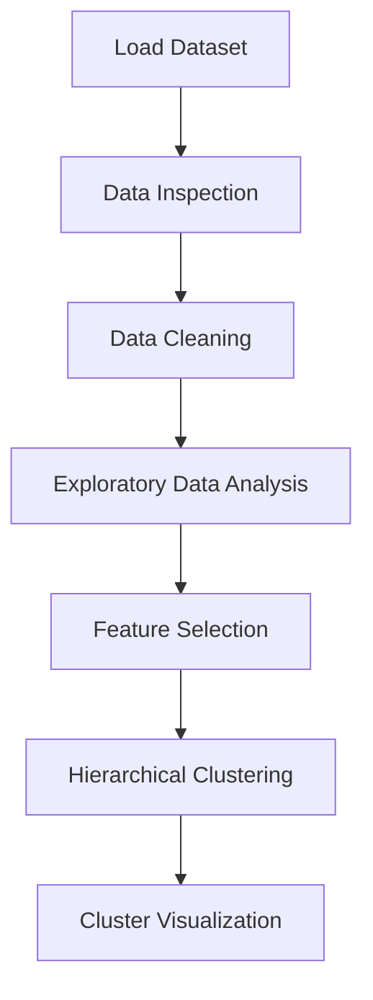

# 🧠 Customer Segmentation using Hierarchical Clustering


This project focuses on **customer segmentation using Hierarchical Clustering**, an **unsupervised machine learning technique** used to group similar data points together.

The goal is to **identify different groups of customers based on their behavior and characteristics**, helping businesses understand their customers and design targeted marketing strategies.

---

# 📌 Project Overview

Customer segmentation is widely used in **marketing and business analytics** to divide customers into meaningful groups.

In this project, we apply **Hierarchical Clustering** to analyze customer data and automatically create clusters of similar customers.

The project includes:

* Data inspection
* Data preprocessing
* Exploratory Data Analysis (EDA)
* Hierarchical clustering
* Cluster visualization

The objective is to **discover natural groupings within customer data**.

---

# 🧠 Machine Learning Workflow



---

# ⚙️ Technologies Used

* Python
* Pandas
* NumPy
* Matplotlib
* Scikit-Learn
* SciPy
* Jupyter Notebook

---

# 📊 Key Analysis Performed

This project includes several important steps in unsupervised learning.

### 1️⃣ Data Inspection

* Checking dataset structure
* Viewing dataset shape
* Identifying missing values
* Understanding feature data types

### 2️⃣ Data Cleaning

* Handling missing values
* Selecting relevant features for clustering
* Preparing dataset for clustering algorithms

### 3️⃣ Exploratory Data Analysis (EDA)

EDA helps understand the distribution of customer data.

Analysis performed:

* Feature distributions
* Relationship between customer attributes
* Identification of potential patterns

### 4️⃣ Hierarchical Clustering

Hierarchical clustering groups customers based on similarity.

Steps involved:

* Calculating distance between data points
* Creating hierarchical clusters
* Building a **dendrogram** to visualize cluster formation

### 5️⃣ Cluster Visualization

Clusters are visualized to understand different customer segments.

This helps identify:

* High-value customers
* Average customers
* Low-spending customers

---

# 📈 Insights Generated

Customer segmentation helps businesses:

* Identify different types of customers
* Improve marketing strategies
* Personalize promotions
* Increase customer engagement

---

# 📂 Project Structure

```
Customer-Segmentation-Hierarchical-Clustering
│
├── Hierarchical Clustering for Customer Data.ipynb
├── requirements.txt
└── README.md
```

---

# 🚀 How to Run the Project

### 1️⃣ Clone the Repository

```bash
git clone https://github.com/your-username/customer-segmentation-hierarchical-clustering.git
```

### 2️⃣ Navigate to the Project Folder

```bash
cd customer-segmentation-hierarchical-clustering
```

### 3️⃣ Install Required Libraries

```bash
pip install -r requirements.txt
```

### 4️⃣ Run the Notebook

Open **Jupyter Notebook** and run all cells in:

```
Hierarchical Clustering for Customer Data.ipynb
```

---

# 🎯 Skills Demonstrated

* Exploratory Data Analysis
* Data Preprocessing
* Unsupervised Machine Learning
* Hierarchical Clustering
* Data Visualization
* Python for Data Science

---

# 🌍 Importance of This Project

Customer segmentation models help businesses:

* Understand customer behavior
* Improve marketing campaigns
* Increase sales and retention
* Deliver personalized customer experiences

Such systems are widely used in **retail, e-commerce, and marketing analytics**.

---

# 👨‍💻 Author

**Taksh Samirkumar Patel**

Computer Science Engineering Student
Interested in **Artificial Intelligence | Machine Learning | Data Science**

🔗 LinkedIn
https://www.linkedin.com/in/taksh-patel-6a6b97325

💻 LeetCode
https://leetcode.com/u/5EWSbJZA6M/

---

⭐ If you found this project useful, consider giving it a **star on GitHub!**
